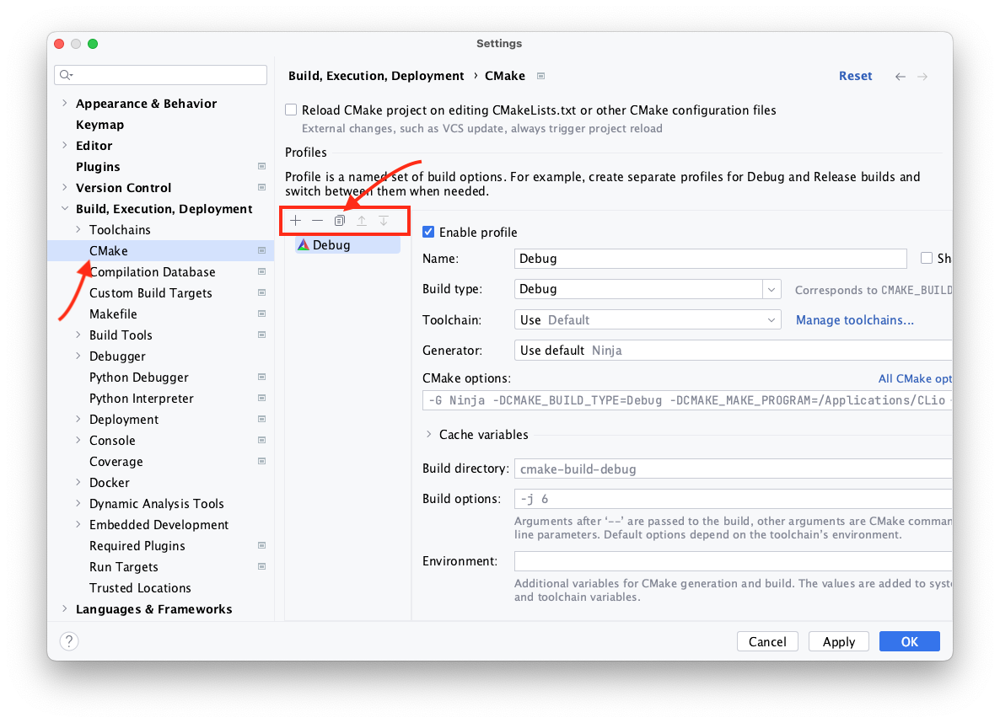
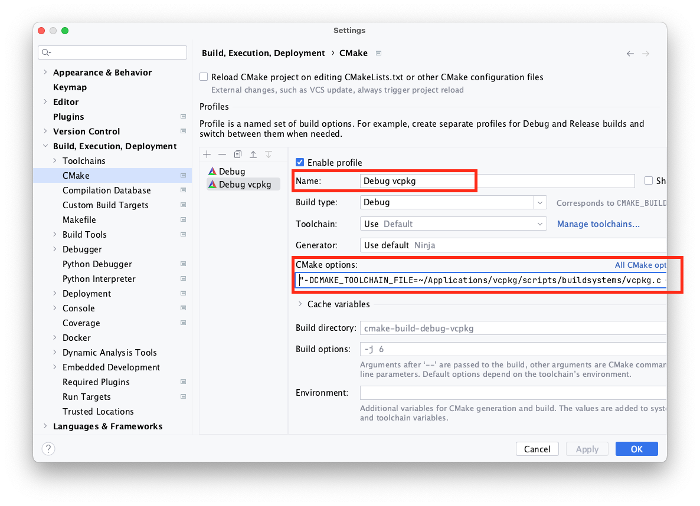
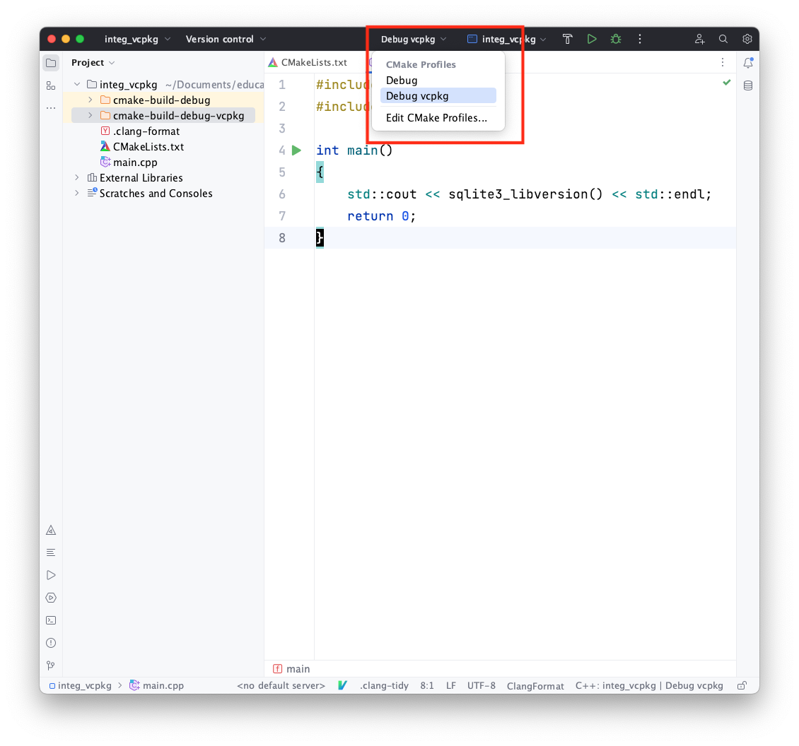

## Configurando o CLion com o vcpkg

O [CLion](https://www.jetbrains.com/pt-br/clion/) é uma IDE multiplataforma para
C e C++ e que, por padrão, usa o [CMake](https://cmake.org/) como gerenciador de
compilação e construção de aplicativos. Já vimos como o `cmake` pode identificar
os arquivos e bibliotecas instalados pelo [vcpkg](https://vcpkg.io/). Agora
precisamos ver como integrá-lo ao `cmake` usado pelo CLion.

De início, crie um projeto C++ normalmente e, em seguida, acesse as preferências
(_Settings_). Dentro de _Build, Execution, Deployment_, acesse a opção _CMake_.
Você deve encontrar a opção de compilação e construção vigente no projeto,
chamada _Debug_. Clique no ícone de duplicar a opção atual.

Um novo conjunto de opções foi criado, mantendo as mesmas configurações que o
modo _Debug_. Vamos renomeá-lo (escolha o nome que desejar) e, nas opções do
`CMake` coloque o argumento que indica as opções do `vcpkg`, exatamente como
no tutorial passado, substituindo `VCPKG_DIR` pelo caminho completo do
diretório de instalação do `vcpkg`.

    "-DCMAKE_TOOLCHAIN_FILE=VCPKG_DIR/scripts/buildsystems/vcpkg.cmake"

Por fim, basta aceitar as alterações (_OK_ ou _Apply_) e escolher a opção
criada antes de construir o projeto.

